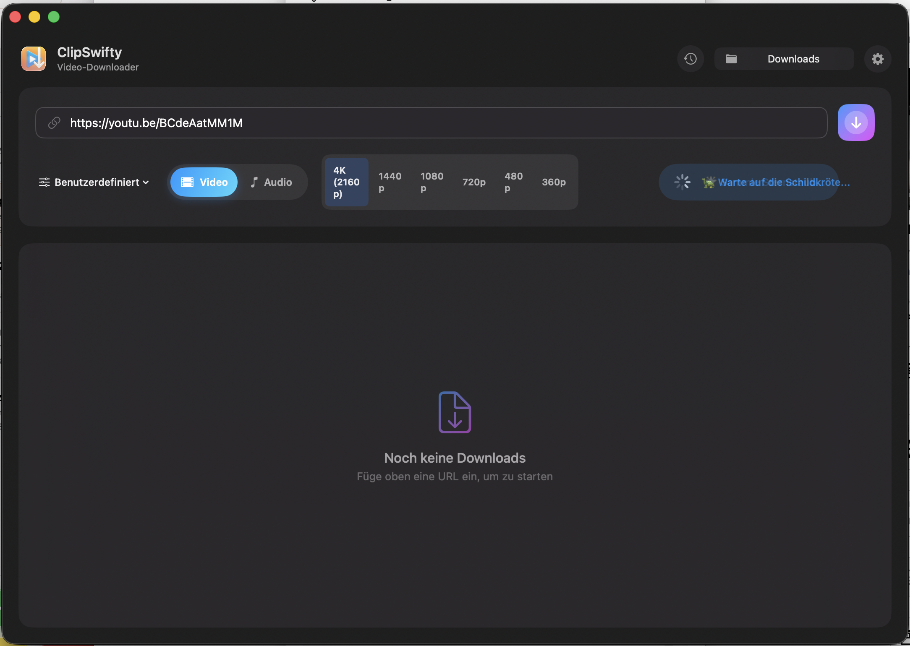
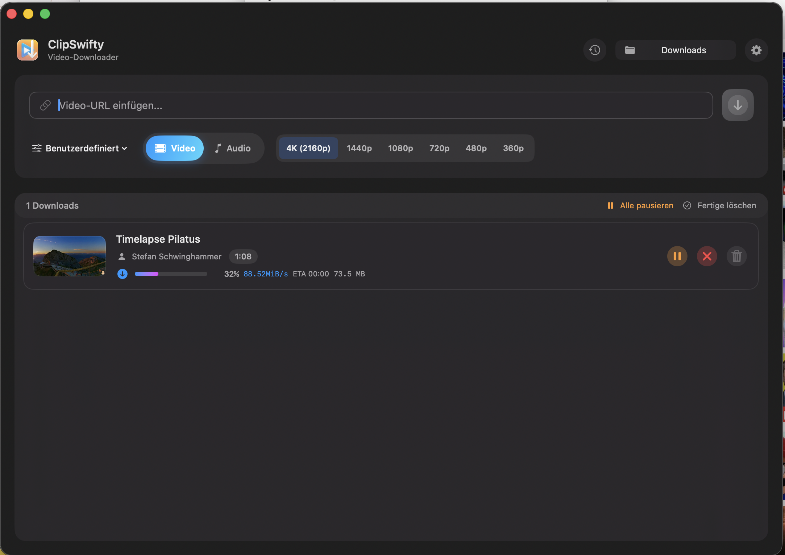
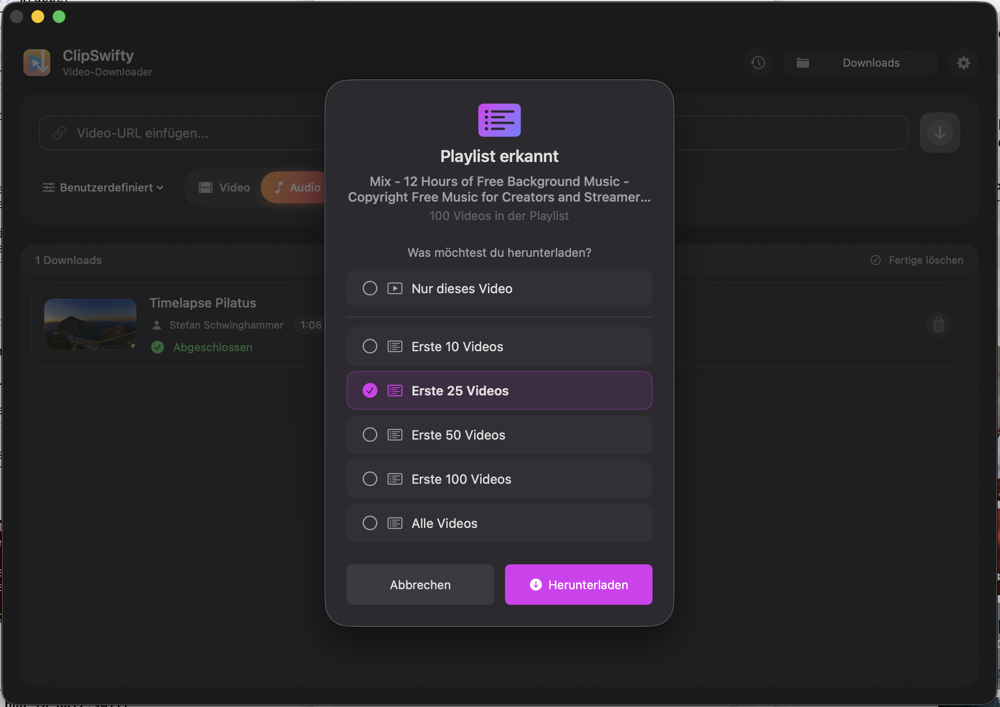

# ClipSwifty

<p align="center">
  
</p>

<p align="center">
  <strong>A beautiful, native macOS app for downloading videos from YouTube and other platforms.</strong>
</p>

<p align="center">
  <a href="https://github.com/akeschmidi/ClipSwifty/releases/latest">
    
  </a>
  
  
  
</p>

---

## Features

- **Easy to Use** – Just paste a URL and click download
- **Auto-Paste** – Automatically detects video URLs in your clipboard
- **Dynamic Quality Selection** – Shows available qualities for each video (4K, 1080p, 720p, etc.)
- **Smart Prefetch** – Loads video info in the background while you decide
- **Playlist Support** – Download entire playlists or select individual videos
- **Multiple Formats** – Video (MP4) or Audio-only (MP3, M4A, WAV, FLAC)
- **Parallel Downloads** – Download multiple videos simultaneously
- **Native macOS Design** – Built with SwiftUI, feels right at home on your Mac
- **Fully Signed & Notarized** – No security warnings, just download and run

## Screenshots

<p align="center">
  
  <br>
  <em>Paste a URL, choose quality, and download – it's that simple</em>
</p>

<p align="center">
  
  <br>
  <em>Track your downloads with real-time progress</em>
</p>

<p align="center">
  
  <br>
  <em>Playlist detected? Choose how many videos to download</em>
</p>

## Installation

### Download

1. Go to [**Releases**](https://github.com/akeschmidi/ClipSwifty/releases/latest)
2. Download `ClipSwifty.zip`
3. Unzip and drag `ClipSwifty.app` to your Applications folder
4. Open the app – no Gatekeeper warnings, it's fully notarized!

### Requirements

- macOS 14.0 (Sonoma) or later
- Apple Silicon (M1/M2/M3) or Intel Mac

## Usage

1. **Copy a video URL** from YouTube, Vimeo, TikTok, or many other sites
2. **Open ClipSwifty** – the URL is automatically pasted
3. **Select quality** – choose from available formats (4K, 1080p, 720p, etc.)
4. **Click Download** – that's it!

### Supported Sites

ClipSwifty supports **thousands of websites** including:
- YouTube (videos, shorts, playlists)
- Vimeo
- TikTok
- Twitter/X
- Instagram
- Facebook
- Dailymotion
- Twitch
- And [many more...](https://github.com/yt-dlp/yt-dlp/blob/master/supportedsites.md)

## ⚠️ Important Notice / Disclaimer

> **Please read this carefully before using ClipSwifty.**

### 📋 Copyright Compliance
Only download content you have permission to download. Respect copyright laws and the terms of service of content platforms.

### 👤 Personal Use
This app is intended for downloading content for personal, non-commercial use only.

### ✋ Your Responsibility
You are solely responsible for how you use this app. The developers are not liable for any misuse.

### 🔗 Third-Party Tool
This app uses yt-dlp, an open-source tool. ClipSwifty is not affiliated with any video platforms.

**By using this app, you agree to use it responsibly and in compliance with applicable laws.**

## Building from Source

```bash
# Clone the repository
git clone https://github.com/akeschmidi/ClipSwifty.git
cd ClipSwifty

# Open in Xcode
open ClipSwifty.xcodeproj

# Build and run
# Press Cmd+R in Xcode
```

### Creating a Release

```bash
# Run the automated release script
./scripts/release.sh 1.2.0
```

This will build, sign, notarize, and publish to GitHub automatically.

## Acknowledgments

ClipSwifty is built on the shoulders of giants. Huge thanks to these amazing open-source projects:

### [yt-dlp](https://github.com/yt-dlp/yt-dlp)

The powerful command-line tool that makes video downloading possible. yt-dlp is a fork of youtube-dl with additional features and improvements. Without this incredible project, ClipSwifty wouldn't exist.

**License:** [Unlicense](https://github.com/yt-dlp/yt-dlp/blob/master/LICENSE)

### [FFmpeg](https://ffmpeg.org/)

The Swiss Army knife of multimedia processing. FFmpeg handles all the audio/video conversion magic behind the scenes.

**License:** [LGPL/GPL](https://ffmpeg.org/legal.html)

---

### Special Thanks

- The entire **yt-dlp community** for maintaining such a fantastic tool
- The **FFmpeg team** for decades of multimedia excellence
- **Apple** for SwiftUI and making native Mac development a joy
- All contributors and users who help make ClipSwifty better

## ☕ Support the Project

Did ClipSwifty save you from sketchy download websites full of ads and pop-ups?

Did it rescue your offline movie collection from extinction?

Is your Downloads folder now suspiciously full of "educational content"? 😏

<p align="center">
  <a href="https://buymeacoffee.com/akeschmidii">
    
  </a>
</p>

<p align="center">
  <em>Your support helps keep the developer caffeinated and the app updated! 🚀</em>
</p>

Every coffee ☕ = One less bug 🐛 (probably)

## Contributing

Contributions are welcome! Feel free to:

- Report bugs via [Issues](https://github.com/akeschmidi/ClipSwifty/issues)
- Submit feature requests
- Open Pull Requests

## License

ClipSwifty is released under the MIT License. See [LICENSE](LICENSE) for details.

---

<p align="center">
  Made with ❤️ in Switzerland 🇨🇭
</p>

<p align="center">
  <a href="https://github.com/akeschmidi/ClipSwifty/releases/latest">
    <strong>⬇️ Download ClipSwifty</strong>
  </a>
</p>
